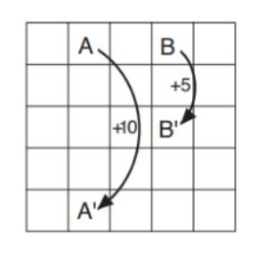
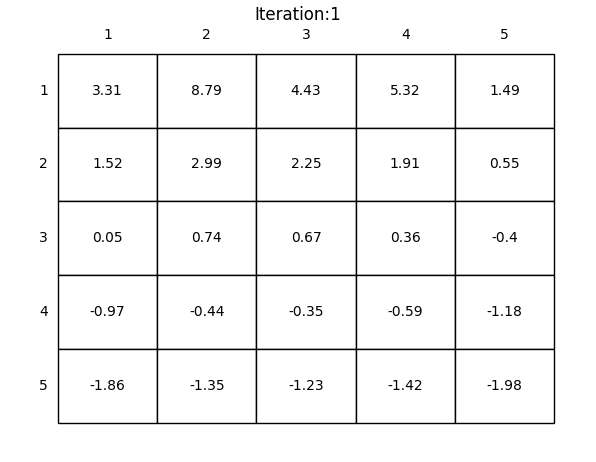

# Solving Gridworld: 
The problem to be solved is a simple example of Gridworld. This grid is a 5 by 5 grid. The agent has four possible actions (left, right, up, down) that will take it one spot to the direction. However, when the action will take the agent out of bounds, its state will not change. There are two special states A and B at positions (0, 1) and (0, 3) respectively. At these spcial states, any action taken will take the agent to (4, 1) and (4, 3). 


The rewards for the actions are as follows: if the action takes the agent out of bounds, it is a reward of -1. If the action is taken place at the special states, it is +10 for state A and +5 for state B regardless of the action. Otherwise, the reward is 0. 



# setting up the grid_world object in envrionment.py: 
first, we must set up the envrionment controller object: 
```python
    def __init__(self):
        self.width = WIDTH
        self.height = HEIGHT


    def is_terminal(self, state):   # Goal state
        x, y = state
        return False
```
First, the constructor sets the width and height of the grid to the the specified wwidth and height by the constants `HEIGHT = 5` and `WIDTH = 5`


The method is_terminal will return false as long as we do not reach the terminal state. Next we have to create the method for interaction. First, the method will receieve an input state and action where state[0] and state[1] are the x and y positions of the state. action[0] and action[1] indicates the action to take (which direction the agent should move) 
`def interaction(self, state, action): #state is a list x, y`.

Then if the the state is terminal, we return 0 for the reward and return the state
```python
        if self.is_terminal(state):
            return state, 0
```
Next we define a function to check whether or not the action that we take will take the agent out of bounds. THe if statement simply checks if the agent is at boundary index and if the next state after the action will be an index that is out of bounds of the 5 by 5 grid. 
```python
        def outOfBounds(state, action):
            if (state[0] + action[0] == -1 or state[0] + action[0] == 5
                or state[1] + action[1] == -1 or state[1] + action[1] == 5):
                return True
            else: 
                return False
```
Then, we can calculate the reward and next state through the following logic:
1. first check if the agent is at special state A or special state B. If it is at one of the special states, then assign the correct next state according to the problem's specifications and give a reward of either 10 or 5.
2. check if the action will take the agent out of bounds using the outOfBounds function. If it does take the agent out of bounds, give a reward of -1 and do not update the state.
3. Otherwise, give a reward of 0 and update the state according to the action. 
4. return the next_state and the reward 
```python
        next_state = [0, 0]
        if state[0] == 0 and state[1] == 1: 
            reward = 10
            next_state[0] = 4
            next_state[1] = 1
        elif state[0] == 0 and state[1] == 3:
            reward = 5
            next_state[0] = 2
            next_state[1] = 3
        elif outOfBounds(state,action):
            reward = -1
            next_state = state
        else:
            reward = 0
            next_state[0] = state[0] + action[0]
            next_state[1] = state[1] + action[1]
        
        return next_state, reward
```
Lastly, the size method will simply return the width and height of the grid: 
```python
    def size(self):
        return self.width, self.height
```
# determining value function in main.py 
Now, in main.py we first import the necssary dependencies and the class definition from environment.py:
```python
import numpy as np
from environment import grid_world
from visualize import draw_image
```
Then we define the size of the world, and a dictionary for the actions to be taken. The actions are simple as they will simply be an array that dictates which diretion the agent should take: 
```python
WORLD_SIZE = 5
# left, up, right, down
ACTIONS = {'LEFT':np.array([0, -1]), 'UP':np.array([-1, 0]),
'RIGHT':np.array([0, 1]), 'DOWM':np.array([1, 0])}
ACTION_PROB = 0.25
```
Next, the evaluate_state_value_by_matrix inversion will determine the value function for this MDP. First, we initialize the width and height by `WIDTH, HEIGHT = env.size()` . Then we will create the reward matrix: 
```python
    R = np.zeros((WIDTH, HEIGHT))
    for i in range(WIDTH):
        for j in range(HEIGHT):
            expected_reward = 0
            for action in ACTIONS:
                (next_i, next_j), reward = env.interaction([i, j], ACTIONS[action])
                expected_reward += ACTION_PROB*reward
            R[i, j] = expected_reward
    R = R.reshape((-1,1))
```
The reward matrix is calculated by first creating a matrix R filled with zeros that is the size of the grid. Then for each state in the grid, we will use the env.interaction method and get the reward by iterating through every action possible. We can then calculate the expected value of the reward at that state by multiplying each reward from the interaction by the probability of the action (0.25) and summing it at that index. Then, we reshape the reward matrix so that we can use the dot product with the transition matrix later. 


Next, the transition matrix can be created by creating a matrix P that has width and height that is width*height. This must be done because the transition matrix indices represent the transition from current state to next state. Thus, for each current state there will be width\*height possible next states. 
```python
    P = np.zeros((WIDTH*HEIGHT, WIDTH*HEIGHT))
    for i in range(WIDTH):
        for j in range(HEIGHT):
            current_state = i*HEIGHT + j
            for action in ACTIONS: 
                (next_i, next_j), _ = env.interaction([i,j], ACTIONS[action])
                next_state = next_i*HEIGHT + next_j
                P[current_state, next_state] += ACTION_PROB
```
To calculate the transition matrix, we can loop through each state and sum the probabilities of the transition to a next state by recieving the next state value from the env.interaction method. We can find the sum by looping through every action at that state and getting the result from the env.interaction method. In this case, we do not use the reward. To ensure that we are at the current index, we must treat the current state and next state indices as flattened 5 by 5 arrays. 


lastly, to calculate the value function, we can use the matrix form of the bellman equation. 

**V = R + (discount)\*P\*max(V)**

**V - (discount)\*P\*V = R**

**V = (I - (discount)\*P)^-1 \* R** 


This can be completed simply through numpy methods and then we can reshape the matrix to our desired width and height (5 by 5)
```python
    V = np.linalg.inv(np.eye(WIDTH*HEIGHT) - discount*P).dot(R)         

    new_state_values = V.reshape(WIDTH,HEIGHT)
```
Lastly, we return the new matrix. 


The main function is simple:
```python
if __name__ == '__main__':
    env = grid_world()
    values = evaluate_state_value_by_matrix_inversion(env = env)
```
We create an grid_world object. Then we call the function to display the values. 

# analysis of value function result 
The result of the calculation of the value function is shown below: 



The results show the state-value function. First, the values near the edge are low. This is because there is a higher probability that the agent will go out of bounds. The edge states are lower near the bottom because the getting to the best valued states (A and B) is harder when further away 


The result also shows how state A and state B are the best states to be. This is self-explanatory as they have the highest reward. However, the expected return from state A is less than 10 even though the immediate reward is 10. This is because when going from A to the next state (A'), it is likely to go out of bounds in the future. state B meanwhile has a higher expected return than its immediate return because the penalty for going out of bounds is compensated by the chance of getting to state A (immeidate reward of 10).


The other results are self-explanatory. The further the state is away from either A or B, the lower the expected return is. 
